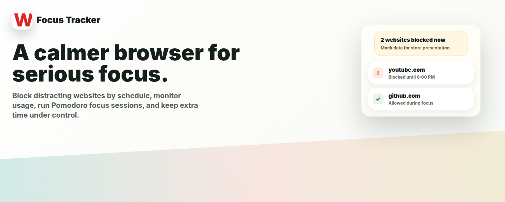
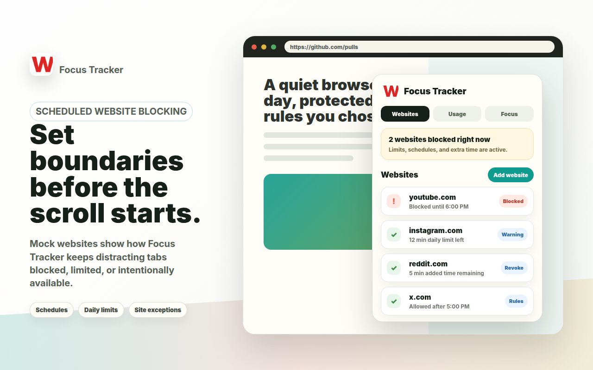
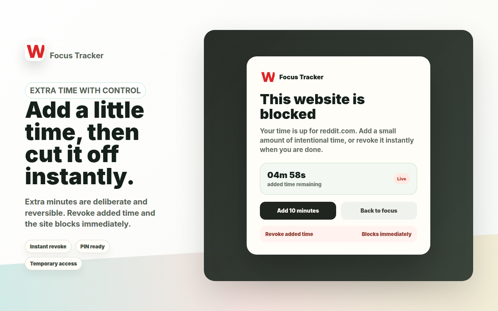
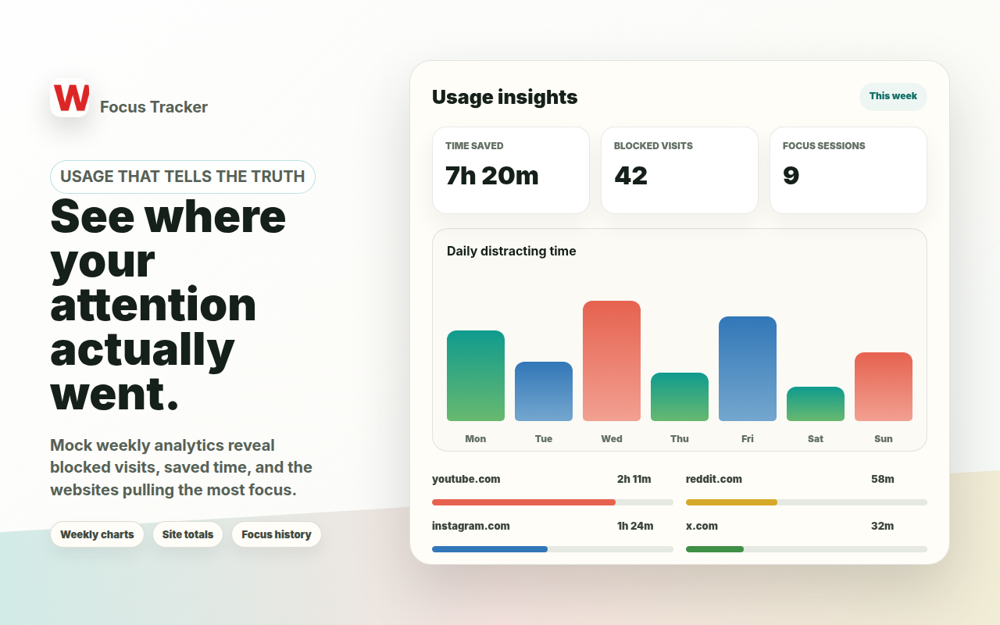
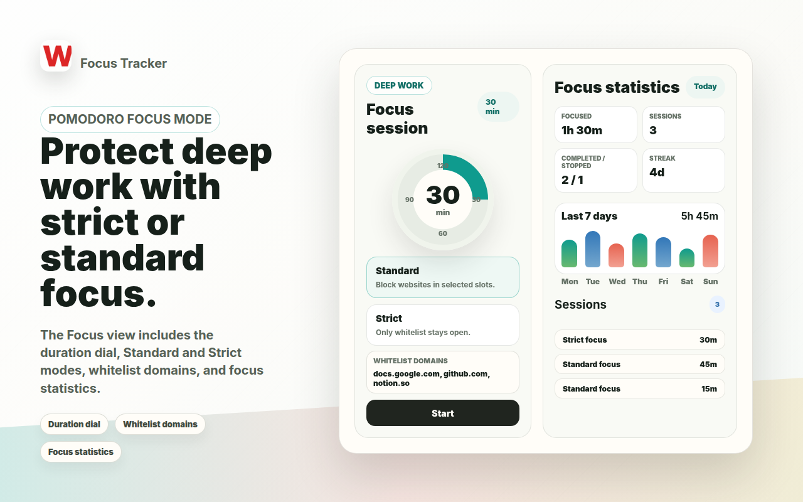
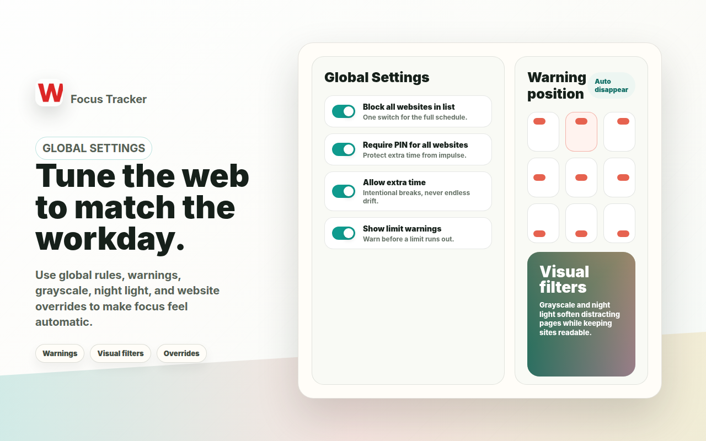

# Focus Tracker

A calmer browser for people who want their attention back.

Focus Tracker turns distracting websites into deliberate choices. Build a schedule for the sites that pull you away, set daily allowances, protect extra time with a PIN, and start Pomodoro focus sessions when you need a clean stretch of work. The extension keeps the rules close to the browser, so you can make fast decisions without opening a separate dashboard.

## What It Does

- Blocks distracting websites by schedule or all the time.
- Tracks daily and weekly website usage locally.
- Adds daily allowances so blocked sites can stay available for a controlled amount of time.
- Lets you grant temporary extra time, protect it with a PIN, and revoke it immediately.
- Includes Pomodoro-style Focus mode with Standard and Strict options.
- Supports website exceptions, global overrides, limit warnings, grayscale, and night light filters.

## Screenshots

### Scheduled Blocking

### Extra Time With Instant Revoke

### Usage Insights

### Pomodoro Focus Mode

### Global Settings And Filters

## Install From Source

1. Clone or download this repository.
2. Open `chrome://extensions` in Chrome.
3. Turn on **Developer mode**.
4. Click **Load unpacked**.
5. Choose the repository folder.

## How To Use It

Open the extension popup and add the websites you want to control. Each website can be blocked all the time or during selected time slots. Time slots use your browser's local time, including overnight schedules like `22:00` to `07:00`.

Daily allowances are only spent while a site is active during a blocked period. If extra time is enabled, the blocked page can grant a few more minutes, and the popup can revoke that added time immediately.

Switch to **Usage** to see totals, daily summaries, weekly charts, hourly usage, website share, and per-site rows. Switch to **Focus** to start a Standard session that blocks your configured sites, or a Strict session that keeps only whitelist domains available.

## Privacy

Focus Tracker is local-first. Schedules, usage, extra time, and preferences are stored with Chrome extension storage on your device.

## Presentation Assets

Chrome Web Store screenshots and promotional images live in [presentation](presentation). The images use mock websites and mock usage data while showing the real product concepts.
