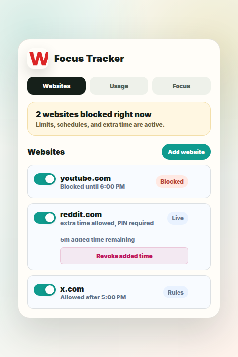
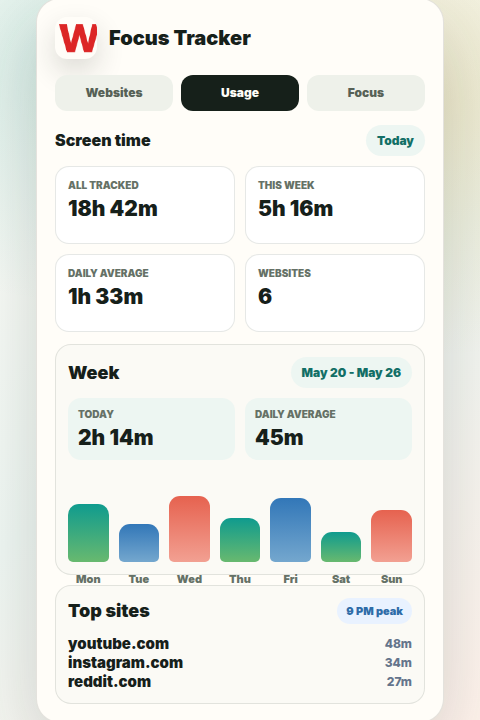
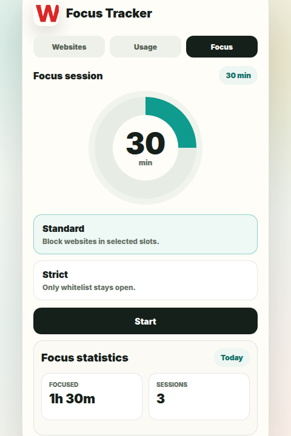

# Focus Tracker - Website Blocker and Focus Timer

A calmer browser for people who want their attention back.

Focus Tracker turns distracting websites into deliberate choices. Build rules for the sites that pull you away, see where your time goes, and start focused work sessions when you need a clean stretch of attention.

## Preview

| Websites | Usage | Focus |
| --- | --- | --- |
|  |  |  |

## Why Focus Tracker

Most website blockers are either too rigid or too easy to ignore. Focus Tracker is built for the middle ground: block what distracts you, keep useful sites available, and make extra time intentional instead of automatic.

The extension keeps the important controls close to your browser, so you can adjust rules, revoke added time, and check usage without opening a separate dashboard.

## Key Features

- Scheduled website blocking with per-site rules.
- Always-blocked mode for sites you want fully restricted.
- Daily allowances for controlled access.
- Extra time that can be granted, protected by PIN, and revoked immediately.
- Pomodoro Focus mode with Standard and Strict sessions.
- Whitelist domains for strict focus sessions.
- Usage analytics for daily and weekly attention patterns.
- Limit warnings with configurable placement and auto-dismiss timing.
- Optional grayscale and night light filters to make distracting pages less rewarding.
- Global settings for website rules, visual filters, warnings, and overrides.

## How It Helps

Use Focus Tracker to set boundaries before the scroll starts. Add websites like social media, video platforms, or forums, choose when they should be blocked, and decide whether limited access should be allowed.

When you need a short exception, extra time makes that choice visible and reversible. If the exception stops being useful, revoke it from the extension and the site blocks again immediately.

Usage insights show where your attention actually went across the day and week, making it easier to tune your rules without guessing.

## Privacy

Focus Tracker is local-first. Schedules, usage, extra time, and preferences are stored with Chrome extension storage on your device.
